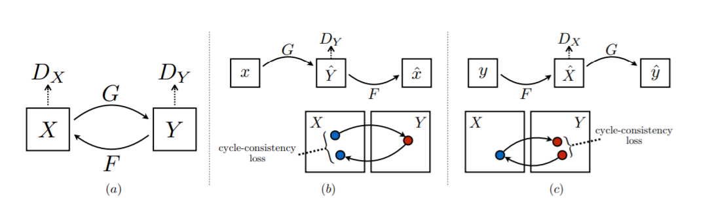

# Implementation of CycleGAN (pytorch)

A **SIMPLE** implementation of cycle GAN (generative adversarial network) in pytorch

datasets tested are from [Kaggle Monet-Photo transfer](https://www.kaggle.com/c/gan-getting-started/data)

