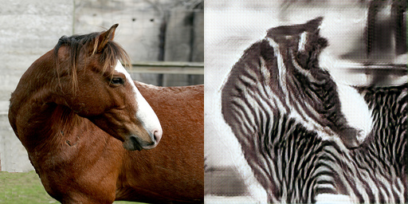
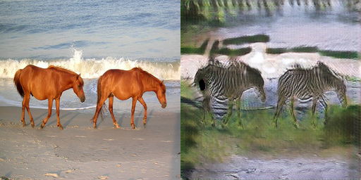

# Implementation of CycleGAN (pytorch)

A **simple & easy to modify** implementation of CycleGAN (Cycle-consistent generative adversarial network) in *pytorch*

Basic illustration of CycleGAN (from original paper): 


Results from re-implementation of this repo using "horse2zebra" dataset (without parameter tuning, which still has some obvious artifacts, you can tune the hyper-parameters to make it better~ )






### Installation and preparation

Download Commonly used datasets for CycleGAN and use them to train and validate the code pipeline
1. Monet-Photo transfer: [Kaggle Monet-Photo transfer](https://www.kaggle.com/c/gan-getting-started/data)
2. Horse-Zebra transfer: [Kaggle Horse-Zebra transfer](https://www.kaggle.com/datasets/balraj98/horse2zebra-dataset)

then prepare the dataset folder in following structure:
```shell
├── monet_dataset
│   ├── monet_jpg
│   └── photo_jpg
└── zebra_dataset
    ├── testA
    ├── testB
    ├── trainA
    └── trainB
```

Git clone this repo and cd to the root folder

```shell
git clone https://github.com/jzsherlock4869/cyclegan-pytorch
cd cyclegan-python
```

install necessary python packages according to `requirements.txt` in the folder

### Start Training

modify the dataroot of `config/000_base_cyclegan_horse2zebra.yml` to your own path for dataset, and run the train process:

```shell
python train_cyclegan.py --opt configs/000_base_cyclegan_horse2zebra.yml
```

Dataset class for "**horse2zebra**" and "**photo2monet**" are already implemented in this repo. 

For training on your own datasets (domain A and domain B), write your own dataloader as ` get_photo2monet_train_dataloader` and `get_horse2zebra_train_dataloader` in `data/sample_dataloader.py`

```python
def get_your_custom_train_dataloader(root_dir="your_path", 
                                     												batch_size=8, 
                                     												img_size=(256, 256)):
    imgA_sub, imgB_sub = "subdirnameA", "subdirnameB" # sub directory name to your root_dir
    postfix_set=["jpg"]  # which postfix is your images
    train_dataset = CycleGANDataset(root_dir, imgA_sub, imgB_sub, postfix_set, img_size)
    train_dataloader = DataLoader(train_dataset, batch_size=batch_size, shuffle=False)
    return train_dataloader
```

and then modify the `train_cyclegan.py` line 54-60 to add your dataset (remember to import them first! )

```python
if which_dataset == 'horse2zebra':
    train_dataloader = get_horse2zebra_train_dataloader(dataroot, batch_size=batch_size, img_size=img_size)
elif which_dataset == 'photo2monet':
    train_dataloader = get_photo2monet_train_dataloader(dataroot, batch_size=batch_size, img_size=img_size)
 # add lines here
 elif which_dataset == 'your_custom_dataset':
    train_dataloader = get_your_custom_train_dataloader(dataroot, batch_size=batch_size, img_size=img_size)
# add lines here
else:
    raise NotImplementedError(f"Unrecognized dataset type : {which_dataset}")
```

### References

This code is an re-implementation for CycleGAN, which is more easy-to-follow and easy-to-modify, especially for beginners. Original paper is:

> @inproceedings{CycleGAN2017,
>   title={Unpaired Image-to-Image Translation using Cycle-Consistent Adversarial Networkss},
>   author={Zhu, Jun-Yan and Park, Taesung and Isola, Phillip and Efros, Alexei A},
>   booktitle={Computer Vision (ICCV), 2017 IEEE International Conference on},
>   year={2017}
> }

A keras version and tutorial with detailed explanations about the theory and process of CycleGAN:

https://machinelearningmastery.com/cyclegan-tutorial-with-keras/

Moreover, this codebase also refered [BasicSR](https://github.com/xinntao/BasicSR) and [UnpairedSR](https://github.com/greatlog/UnpairedSR) for the code architecture and style, and some functions are directly borrowed from them. Appreciations for their great works~
